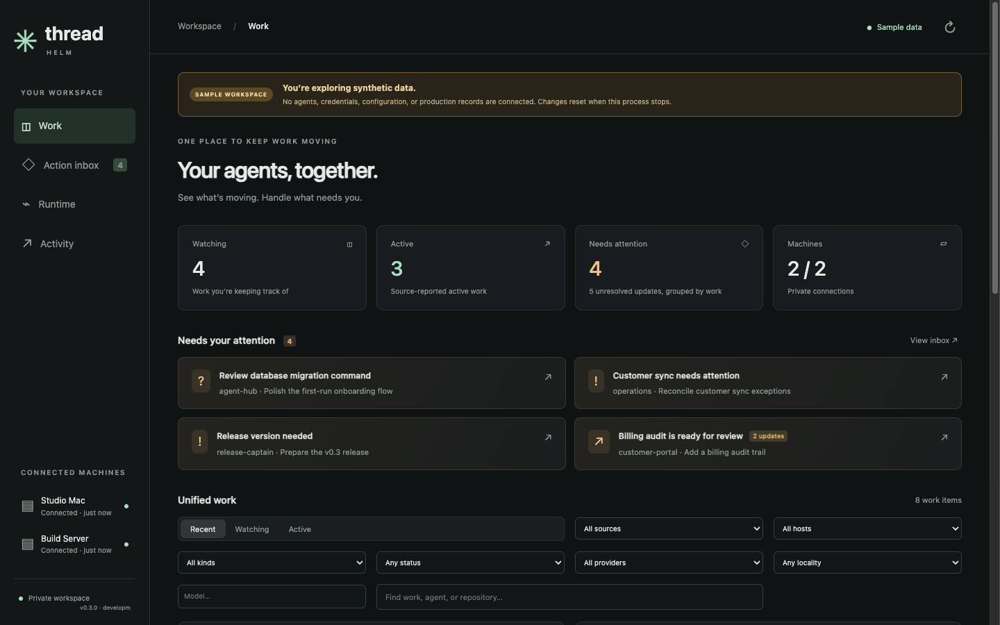
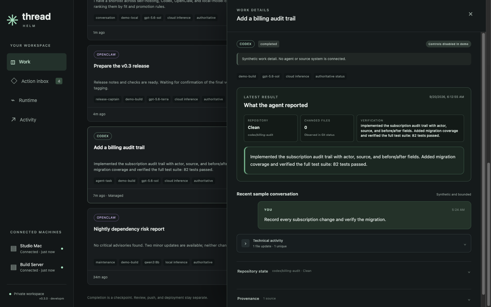

# ThreadHelm

**One action inbox for AI work already running across your machines.**

ThreadHelm is an open-source, self-hosted workspace for seeing Codex, Claude Code, Hermes, OpenClaw, and Open WebUI work in one place. It discovers work where it already lives, normalizes what each source can prove, and brings approvals, failures, interrupted work, and watched completions into a durable owner-only inbox.

Early preview · single owner · MIT licensed · independent project, not affiliated with OpenAI or Anthropic.



## Why ThreadHelm

Agent work rarely happens in one app. A coding task is running on a laptop, another is waiting on a server, a local model is loaded somewhere else, and the important approval is buried in a different client.

ThreadHelm gives that scattered work one operating surface without pretending every runtime has the same controls:

- **Observe first.** Existing work appears without requiring it to be launched from ThreadHelm.
- **Route attention.** Ordinary chat stays quiet; decisions, failures, interrupted work, and watched completions remain visible until handled.
- **Report capabilities truthfully.** Each source advertises the actions it actually supports. Observation-only sources never render fake mutation controls.
- **Keep ownership local.** Full transcripts and provider credentials stay in their source systems. The hub stores normalized metadata, bounded excerpts, and its audit trail.

## Product surfaces

| Surface | What it answers |
| --- | --- |
| **Unified work** | What is running, waiting, complete, or stale across every connected source and machine? |
| **Action inbox** | Which decisions, failures, delivery problems, or watched completions need me? |
| **Task review** | What result came back, which branch and files changed, and what verification was reported? |
| **Runtime** | Are connectors, model catalogs, routing, metrics, and loaded local models healthy? |
| **Coordinator** | Which bounded actions should happen next across tasks, machines, and the inbox? |
| **Activity** | Which instructions and decisions were dispatched, and what outcome was recorded? |

The distinction is deliberate: conversations and agent tasks belong in **Work**; raw inference requests do not. Model and router health belongs in **Runtime**.

The coordinator is on-demand rather than autonomous background traffic. It uses `codex exec` to produce bounded recommendations from the current workspace snapshot. Coordinator output is proposal-only in this release: the server records what it recommends and does not execute those actions. Direct controls remain explicit owner actions.



## Supported today

| Source | Discover existing work | Bounded detail | Actions from ThreadHelm |
| --- | :---: | :---: | --- |
| Codex | Yes, from configured local or SSH runtimes | Yes | Create, resume/send, steer, interrupt, answer supported requests, watch, and archive—subject to session ownership |
| Claude Code | Yes, from local activity files or an SSH-connected ThreadHelm workstation | Yes | Observation only; waiting sessions can enter the inbox |
| Hermes | Yes | Yes | Observation only; optional deep link |
| OpenClaw | Yes | Yes | Observation only; approvals and failures can enter the inbox, but are handled in OpenClaw |
| Open WebUI | Yes | Yes | Observation only; optional deep link |

See the [compatibility matrix](docs/COMPATIBILITY.md) for exact status semantics, control boundaries, protocol assumptions, and tested versions. Claude controls and outbound-paired machine connectors remain [roadmap](docs/ROADMAP.md) work.

## Try the product with sample data

The sample workspace needs no Codex login, SSH connection, source credentials, or configuration:

```sh
npm ci
npm run demo
```

Open `http://localhost:4318`. Demo data is synthetic, stored only in memory, and reset when the process stops. Real-agent controls are disabled; harmless actions such as watching work or handling a sample inbox item affect only the temporary demo. It cannot connect to an agent or mix with a configured workspace.

## Connect your workspace

Requirements:

- Node.js 22.19 or newer
- Python 3
- Codex installed and signed in on each Codex machine
- Existing noninteractive SSH connectivity for any remote Codex machine

```sh
npm ci
npm run build
mkdir -p data
cp config.example.json data/config.json
npm start
```

Before starting, edit `data/config.json`:

1. Replace the example host paths and SSH aliases with your own.
2. Remove unavailable entries from `sources`. Configure loopback endpoint and `0600` credential files for network sources; configure absolute owner-local activity paths for Claude Code, or its read-only SSH bridge when the hub runs on another machine.
3. Remove `runtime` if you do not run a compatible local model broker.

Open `http://localhost:4318`. The service binds to loopback by default.

For a durable install, use `python3 scripts/install-local.py` on macOS or `python3 scripts/install-linux.py` on Linux after configuration and a clean commit. The installers run the complete verification suite, build a checksum-verified artifact, preserve private state, and record the exact release identity. Read [hosting](docs/HOSTING.md) and [operations](docs/OPERATIONS.md) before publishing access outside the machine.

## What makes it safe to trust

- Source adapters fail independently; one incompatible source does not take down the workspace.
- Work is correlated only by an exact propagated identifier. Similar titles, text, or timestamps never merge conversations.
- SQLite contains normalized metadata and at most a 4,000-character latest excerpt. Detail is fetched on demand and bounded to 30 entries.
- Credential files must be owner-only (`0600`), network source endpoints must be loopback, Claude activity paths must be absolute and owner-local, SSH bridges may call only a loopback ThreadHelm endpoint on the workstation, and secrets are stripped from Runtime payloads and errors.
- Command delivery is idempotent. Uncertain delivery remains visible for review and is never retried automatically.
- Coordinator recommendations are proposal-only at the server boundary. They cannot send, create, archive, clear inbox items, or answer approvals.
- Codex controls are enabled only for exact App Server versions that passed the release probe; inventory remains visible when an unknown version disables controls.
- Existing databases are backed up with SQLite before each ordered schema migration. Command audit rows identify the owner, coordinator, or autopilot actor.
- New Git work uses a sibling `codex/*` worktree by default. Running in an occupied checkout requires an explicit override.
- Public access requires an authenticated reverse proxy plus application-side identity verification. Never expose the bare dashboard or an agent runtime to the Internet.

The [security policy](SECURITY.md) explains the owner-only threat model and private reporting process. The [architecture](docs/ARCHITECTURE.md) explains normalization, bounded storage, correlation, and repository coordination.

## Important limits

ThreadHelm is not a replacement for each source’s native client.

- Claude Code, Hermes, OpenClaw, and Open WebUI are observation-only in this release.
- The standalone panel does not capture ChatGPT conversations or Codex Cloud tasks. Codex discovery is limited to the configured local or SSH runtime projections.
- Existing desktop-owned Codex tasks cannot be steered or interrupted until their owning client releases them. Start a Codex task from ThreadHelm for its full supported control surface.
- Managed Codex runtimes currently belong to hub subprocesses. Restarting the hub interrupts that ownership and invalidates pending approvals; those approval IDs are never replayed, so the agent must issue a new request after the task resumes.
- Worktrees isolate directories; they do not prove that two task scopes are compatible or that their branches will merge cleanly.
- A completed agent turn is a review checkpoint, not evidence that code was pushed, merged, deployed, or production-ready.
- Runtime status reports observation freshness. An offline source does not prove that its remote agent stopped.

Permanent deletion, automatic retry, push, merge, deployment, and worktree removal are intentionally outside the coordinator’s authority. See [the full roadmap](docs/ROADMAP.md) for persistent managed runtimes, repository reservations, review/release actions, notifications, and additional providers.

## Configuration at a glance

`config.example.json` contains one example of every connector. A typical installation has:

- `hosts`: the hub machine plus optional SSH-reachable Codex machines;
- `sources`: zero or more Claude Code, Hermes, OpenClaw, and Open WebUI adapters;
- `runtime`: an optional loopback model/router inventory source;
- `coordinator`: optional model, reasoning, and maximum-action settings;
- `supervisorName`: the private display name for the coordinator, such as `Astra`;
- `publicOrigin` plus an authentication mode only when using authenticated HTTPS access.

Keep `data/` private. It contains configuration, bounded work excerpts, the inbox, and the audit trail and is excluded from Git. Provider credentials live outside the repository and are never returned to the browser.

## Verify a change

```sh
npm run build
npm test
python3 -m unittest discover -s tests -p '*_test.py'
```

The current automated and live acceptance record is in [verification](docs/VERIFICATION.md).

## Become a Founding Operator

We are recruiting the first 15 people who supervise agents across multiple sources or machines every week. Founding Operators get hands-on installation help, a fast bug-response loop, and direct influence over the compatibility matrix. In return, we ask for two short rounds of honest feedback over four weeks.

Start with disposable work you control. No endorsement, star, public quote, screenshot, or case study is required. [Apply through the opt-in GitHub form](https://github.com/shadoprizm/threadhelm/issues/new?template=founding-operator.yml).

## Help shape the project

The most useful contributions are grounded in a real supervision workflow:

- report a source version that works—or fails—with the [compatibility contract](docs/COMPATIBILITY.md);
- propose an adapter with its documented API, ownership model, and honest minimum capability set;
- contribute synthetic fixtures for source failures, reconnects, pagination, and approval lifecycles;
- improve installation on a clean macOS or Linux machine;
- document a case where the inbox prevented missed work or reduced context switching.

Start with an issue before a large change. Integration requests should identify the source’s documented API and distinguish observation from control. Read [contributing](CONTRIBUTING.md) for the development and privacy rules.

## Project map

- [Compatibility](docs/COMPATIBILITY.md) — exact source and capability support
- [Roadmap](docs/ROADMAP.md) — delivered and planned milestones
- [Architecture](docs/ARCHITECTURE.md) — data model, adapters, controls, and coordination rules
- [Hosting](docs/HOSTING.md) — server installation and authenticated browser access
- [Operations](docs/OPERATIONS.md) — backup, migration, recovery, and updates
- [Verification](docs/VERIFICATION.md) — automated and live evidence
- [Contributing](CONTRIBUTING.md) — issue, test, privacy, and pull-request expectations
- [Security](SECURITY.md) — threat model and private vulnerability reporting

---

If your agents already work across more than one machine or runtime, ThreadHelm is being built for your day-to-day reality. Try it on disposable work first, tell us exactly where the model breaks, and help make multi-agent supervision boringly reliable.
