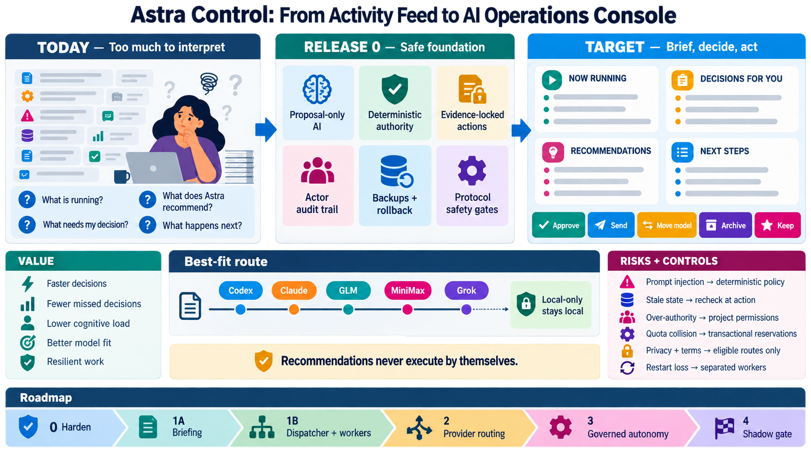

# Astra Control: AI operations console proposal

## Product decision

Astra Control should become an attention and decision system for all observed AI work. The first screen should answer four questions without requiring the owner to reconstruct a task from transcripts, logs, and metadata:

1. What is running right now?
2. What needs my decision?
3. What does Astra recommend, and why?
4. What happens next?

Every recommendation must include evidence, risk, and a small set of relevant actions. A recommendation never grants itself authority and never executes by itself. Owner actions pass through a deterministic policy and, once Release 1B exists, a validated dispatcher that rechecks current state immediately before execution.

The [generation prompt](assets/astra-control-evolution.prompt.md) is retained with the asset for provenance and future revisions.

### Text equivalent of the infographic

The visual moves from left to right. Today, the owner sees a dense activity feed and has to determine what is running, what needs a decision, what Astra recommends, and what happens next. Release 0 places six controls between observation and action: proposal-only AI, deterministic authority, evidence-locked actions, an actor audit trail, database backups with tested rollback, and protocol safety gates. The target interface has four stable areas—Now running, Decisions for you, Recommendations, and Next steps—with quick actions such as Approve, Send, Move model, Archive, and Keep. Model routing can consider Codex, Claude, GLM, MiniMax, and later Grok, while local-only work stays local. The intended value is faster decisions, fewer missed decisions, lower cognitive load, better model fit, and more resilient work. The corresponding controls address prompt injection, stale state, excess authority, quota collisions, privacy and provider terms, and work lost during hub restarts. The roadmap is Release 0 hardening, Release 1A briefing, Release 1B dispatcher and workers, Release 2 provider routing, Release 3 governed autonomy, and Release 4 shadow gating.

## The daily experience

The overview is ordered by owner attention rather than source or recency. Each active task has a compact briefing with the same four fields:

| Field | Example | Source of truth |
| --- | --- | --- |
| **Now** | “Running tests on the migration; 3 minutes since the last event.” | Observed runtime state and recent structured events |
| **Decision** | “Choose whether to preserve the old API for one release.” | Open approval, explicit agent question, or deterministic policy conflict |
| **Recommendation** | “Keep this in Codex; the task owns a live worktree and is near completion.” | Astra analysis tied to an evidence revision |
| **Next** | “Review the diff when tests finish.” | Deterministic state transition plus bounded analysis |

The default dashboard contains four matching groups:

- **Now running** shows only work with authoritative activity, the concrete current operation when known, elapsed time, host, and provider.
- **Decisions for you** shows the question, choices, consequence, deadline if one exists, and the evidence that created it.
- **Recommendations** explains what Astra would change, why, its confidence, expected value, material risk, and whether the action is currently eligible.
- **Next steps** shows the next observable checkpoint for watched work. It does not invent activity when the source cannot prove it.

Suggested cleanup such as Archive, Keep, or Snooze belongs in Recommendations. It must not remove work merely to make the screen look tidy. “Move model” means prepare a reviewable continuation on another eligible route; it does not silently move an in-flight task or discard its existing context.

## Quick actions and decision levels

Buttons are rendered from capability, policy, and current evidence. A disabled action explains the failed condition in plain language.

| Level | Examples | Required checks |
| --- | --- | --- |
| **Review** | Open, watch, keep, inspect evidence | Authenticated owner; no mutation |
| **Routine owner action** | Archive, snooze, pause | Current capability, current task state, idempotency key, audit actor |
| **Dispatched action** | Send, create continuation, move model | Matching proposal and evidence revision, refreshed state, project authority, route eligibility, transactional quota reservation |
| **High impact** | Accept a consequential approval, publish, deploy, spend, send externally | All dispatcher checks plus an in-app passkey signature bound to action ID, evidence revision, nonce, and expiry |

The dispatcher receives structured actions only. It re-reads task state, policy version, project authority, provider capability, quota windows, repository reservation, and emergency-stop state in one execution preflight. Its idempotency key is derived from the recommendation ID and evidence revision, so a retry cannot become a new command.

## Authority begins with the project

Task prose cannot define its own permissions. The owner sets a versioned project default once using the [per-project objective and authority template](PROJECT_OBJECTIVE_TEMPLATE.md). Submission inherits that template and may only narrow it.

The agreed objective is the submitted objective, definition of done, project-template identity and version, and the resulting effective scope. A change to any of those fields creates a new objective revision. Adding a provider, filesystem root, action class, network destination, or higher funding limit requires an owner decision that shows the exact difference.

Unattended execution is limited to deterministic action classes explicitly set to `allow` in the project template. New action classes default to `deny`. Local-only projects are rejected from cloud analysis and cloud execution at the queue boundary.

## Tiered analysis

All work receives a deterministic briefing built from state, timestamps, approvals, failures, watch state, and source capabilities. Model analysis is reserved for watched, active, waiting, and failed items. Completed and idle history is analyzed only on demand.

Release 1A starts with a seven-day measurement period. Each route records calls, latency, excerpt size, and input/output tokens when the provider reports them. Routes that do not report tokens are governed by call count. The measurement period has a hard ceiling of 20 model calls per day, at most one call per work item and evidence revision, and a secondary 100,000-token ceiling only where usage is observable. The production budget is then set from measured p50 and p95 demand rather than assuming a fixed token cost per call.

Prompts contain the smallest bounded excerpt required for the briefing. Analysis of a local-only project is pinned to an eligible local model. The queue enforces this before prompt construction so restricted context cannot leak through analysis.

## Provider order and eligibility

Releases 2 and 3 concentrate on four routes in this order:

1. **Codex** — existing controlled route and reference implementation.
2. **Claude Code** — existing observation integration, promoted only through a documented control surface.
3. **GLM** — candidate alternative route after capability, privacy, and terms review.
4. **MiniMax** — candidate alternative route after the same review.

Grok remains a later candidate so the first routing release does not spread validation across five providers. The registry records documented controls, sandbox behavior, approval policy, context limits, locality, cost source, data handling, and `permittedByTerms`. A time-boxed go/no-go spike is required for every provider before control work begins.

A provider is eligible for unattended execution only when its native sandbox and approval policy can enforce the project boundary. Routes without those controls may remain recommendation-only or owner-attended. The project will not build a separate operating-system isolation platform.

Routing recommendations compare task type, current ownership, required tools, locality, remaining context, forecast quota, cost, and validated provider capabilities. A model's own opinion is one input; the deterministic eligibility filter makes the final route set.

## Usage and quota rules

Every applicable provider window is evaluated independently. A route is constrained when any window has 25% or less remaining. Unknown or stale usage is treated as constrained. Scheduled work reserves its forecast p90 demand for every applicable window, and reservations are committed transactionally in SQLite so two workers cannot spend the same headroom.

A recommendation may still show a constrained route for owner review, but an unattended dispatcher cannot select it. Forecast errors and owner overrides are recorded so reservations can be calibrated from actual demand.

## Worker lifetime and deployment

Release 1B begins with a five-working-day spike against the supported App Server connection surface. It must test simultaneous clients, send and steer, question and approval ownership, interrupt, disconnect and reconnect, hub restart, and runtime version change. The experimental transport is not accepted as a production dependency without a supported compatibility commitment.

If the spike succeeds, managed runtime lifetime moves into workers that survive hub and browser restarts. If it fails, the fallback is explicit: the hub may continue to own runtimes, but every deployment must enter drain mode, refuse new work, wait for managed turns to reach a safe checkpoint, and report any task that prevents restart. A deploy cannot silently kill managed work or expire an approval.

The “no competing writers” guarantee applies to work managed by Astra Control. Repository leases prevent two managed writers from sharing a checkout. Observed external writers produce a warning and can block dispatch when ownership is uncertain; the system does not claim to control external tools.

## Security and recovery decisions

- **Step-up authentication:** high-impact actions require an in-app passkey signature over the exact action and evidence revision. Reverse-proxy authentication alone is insufficient because it is not bound to the action.
- **Emergency stop:** workers check `~/.local/share/threadhelm/STOP` before acquiring a lease, before dispatch, and between tool cycles. The owner can create it over SSH even when the hub is unavailable. Removing it is an explicit owner operation.
- **At-rest secrets:** provider credentials stay in the platform keychain or service credential store. Browser-session material is encrypted with a machine-bound service key. This deliberately preserves unattended restart after reboot instead of requiring an owner-supplied boot secret; a fully compromised, unlocked owner account remains outside that protection boundary.
- **Migration recovery:** ordered migrations take a SQLite-native backup before each change. Rollback drills remain a release requirement.
- **Protocol drift:** exact version and capability probes disable controls while keeping observation available.

## Public core and private operator data

The public ThreadHelm repository contains the policy engine, project-authority schema, proposal ledger, dispatcher contract, generic workers, source interfaces, safety tests, and non-personal UI. Private configuration or private plugins contain credentials, owner identity and email, subscription details, Sovereign Mail integration, GPU-broker endpoints, browser sessions, provider eligibility decisions, and the historical shadow corpus.

Connectors with unresolved provider terms remain private and disabled in the public distribution. The public repository uses the configurable supervisor label and the ThreadHelm product name. Legacy `ASTRA_*` environment names warn throughout Releases 1 and 2 and are removed in the 1.0 migration release after Release 2.

## Delivery plan and definitions of done

### Release 0 — Harden the existing control plane — complete

Delivered: proposal-only coordinator enforcement, deterministic actor/action policy, evidence-locked proposal IDs, execution-time state boundaries, direct approval lookup, actor audit records, ordered migrations with backups, adversarial tests, exact protocol gates, objective templates, and measured pre-briefing decision baseline. The release is complete only while automated tests pass and rollback is verified on both macOS and Linux.

### Release 1A — Read-only briefing

Deliver the four-field task brief, attention-ordered overview, reasoned recommendations, deterministic briefing for every item, tiered model analysis, and recommendation feedback controls. No recommendation can call a mutation route.

Implementation status: the deterministic briefing, attention overview, evidence expansion, task cards, revision-bound feedback, and evidence-drift suppression are shipped in measurement mode. Model recommendations currently come only from on-demand coordinator proposals. Automatic tiered analysis remains disabled until call, latency, excerpt-size, and observable token instrumentation completes its seven-day shadow period.

Definition of done:

- At least 90% of sampled active, waiting, and failed cards accurately represent the source state and expose uncertainty.
- Every decision and recommendation links to an evidence revision and can be marked useful, wrong, or stale.
- The briefing path issues zero mutation requests in adversarial tests and live shadow use.
- After 50 owner decisions or 14 days, whichever is later, median time-to-decision improves by at least 20% from the immutable Release 0 baseline, while missed actionable decisions do not increase.

### Release 1B — Validated dispatcher and durable workers

Start with the App Server spike and adopt durable workers only if the transport and ownership tests pass. Build the dispatcher, state recheck, project-authority evaluation, idempotency, repository leases, and drain fallback before enabling Send, Create continuation, or Move model.

Definition of done:

- Stale evidence, excess authority, incompatible protocols, unavailable usage, emergency stop, and duplicate delivery all fail closed in tests.
- A hub restart does not lose managed work in the worker design; the fallback drain blocks restart while unsafe work remains.
- Disposable live tasks cover send, create, approval, interrupt, reconnect, and restart on each supported host version.

### Release 2 — Provider routing

Complete go/no-go spikes and registry entries for Codex, Claude Code, GLM, and MiniMax. Add capability-aware recommendations and owner-reviewed continuation creation. Keep Grok in discovery until the first four routes are stable.

Definition of done:

- Every enabled provider has a documented API or runtime surface, verified terms eligibility, a capability probe, privacy classification, and an owner-visible failure mode.
- At least three providers pass the recommendation path; only routes with enforceable boundaries can execute unattended.
- Local-only fixtures produce zero cloud analysis or dispatch attempts.
- At least 80% of owner-labeled routing recommendations are accepted or rated useful during a 50-recommendation sample.

### Release 3 — Governed autonomy

Add transactional quota reservations, scheduled-work forecasts, action-bound passkey authorization, worker emergency-stop checks, encrypted session storage, and project allowlists for unattended action classes.

Definition of done:

- Two concurrent workers cannot reserve the same provider headroom or repository lease.
- Unknown usage and any constrained quota window block unattended routing.
- The stop file prevents new dispatch with the hub down and halts active work at the next defined checkpoint.
- Providers without native sandbox and approval enforcement remain ineligible for unattended work.

Before Release 3 begins, reassess the product if Release 1A did not improve time-to-decision or missed-decision rate. More automation is not the remedy for an ineffective briefing.

### Release 4 — Shadow gate and class-by-class enablement

Run every candidate unattended decision in shadow, compare it with the owner's label, and keep execution disabled until its action class passes.

Definition of done:

- At least 100 live shadow decisions in total across at least seven days.
- At least 20 live decisions in each action class proposed for unattended enablement. A rare class that cannot meet this volume remains owner-confirmed, even if replay results are strong.
- At least 95% agreement overall and at least 95% within every class being enabled.
- Zero high-impact false approvals.
- 500 replay scenarios from real history, stored only in private fixtures, plus public synthetic hostile-transcript and hostile-approval tests.
- A written owner review budget covers labeling the live decisions; missing labels do not count as agreement.

Enablement is class by class and project by project. Passing the shadow gate does not create general authority.

## Measures that decide whether this works

The primary measures are median and p90 time from decision creation to owner resolution, the number of actionable decisions that remain unresolved beyond their expected window, recommendation override rate, stale-recommendation rate, and high-impact false approvals. Supporting measures include the time needed to answer the four dashboard questions, model-analysis spend, route failures, task interruption during deploys, and percentage of recommendations whose evidence the owner opens.

The product succeeds when the owner can understand the current state in seconds, act with confidence, and recover the evidence behind every suggestion. More buttons, providers, and automation do not count as success unless those measures improve.
